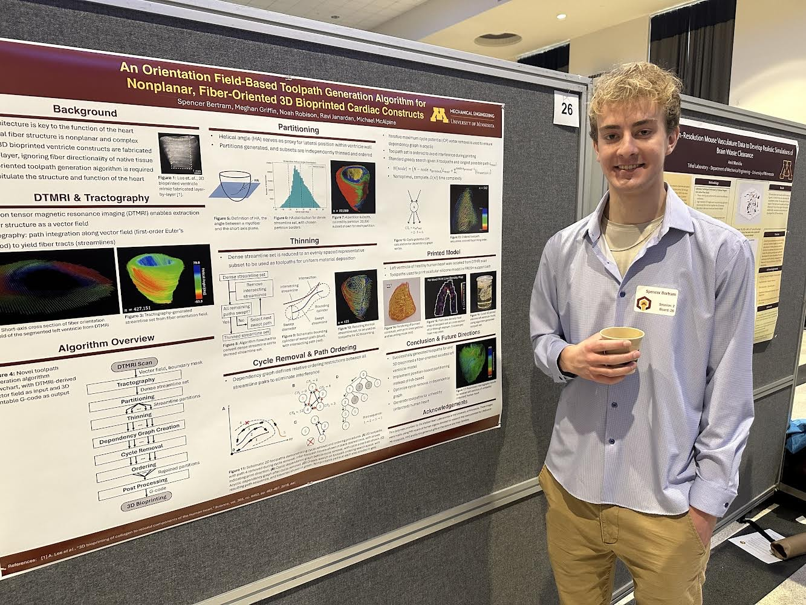

<!-- At the University of Minnesota Spring 2024 Undergraduate Research Symposium, I presented the culmination of my undergraduate thesis work. I described our novel process for 3D bioprinting fiber-oriented cardiac constructs that mimic the fiber architecture of native cardiac tissue. A pdf of my poster can be found <a href="https://drive.google.com/file/d/1CMkJblXxCzj8uRPRVy-yL5oGXhY-av6N/view?usp=sharing" target="_blank">here</a>. My presenter profile can be found <a href="https://ugresearch.umn.edu/presentation-opportunities/spring-symposium/presenters-2024/spencer-bertram" target="_blank">here</a>. -->

<a href="https://drive.google.com/file/d/1CMkJblXxCzj8uRPRVy-yL5oGXhY-av6N/view?usp=sharing" target="_blank">Download Poster</a>

<a href="https://ugresearch.umn.edu/presentation-opportunities/spring-symposium/presenters-2024/spencer-bertram" target="_blank">Presenter Profile</a>

